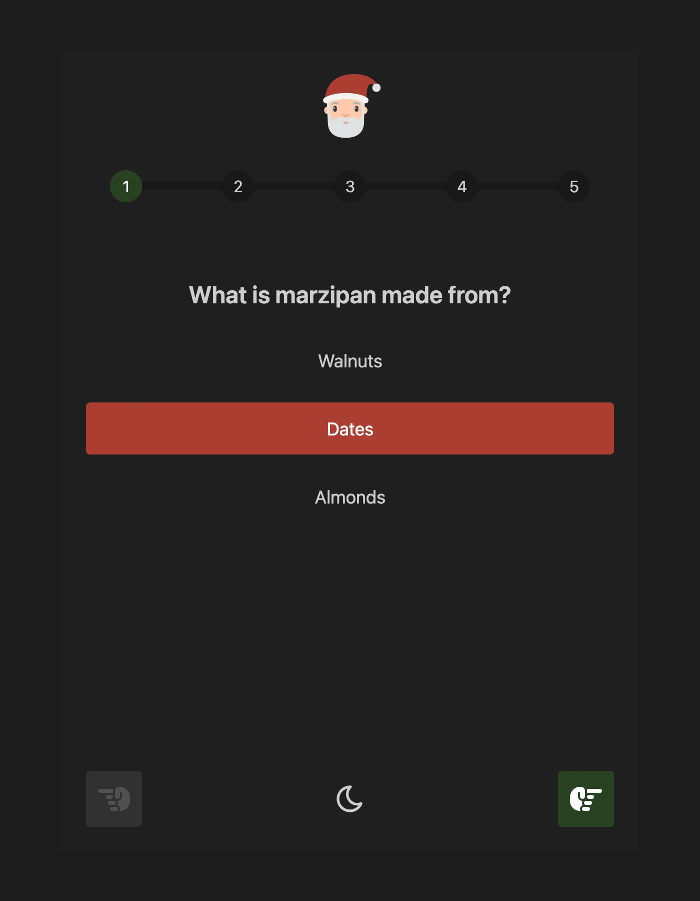
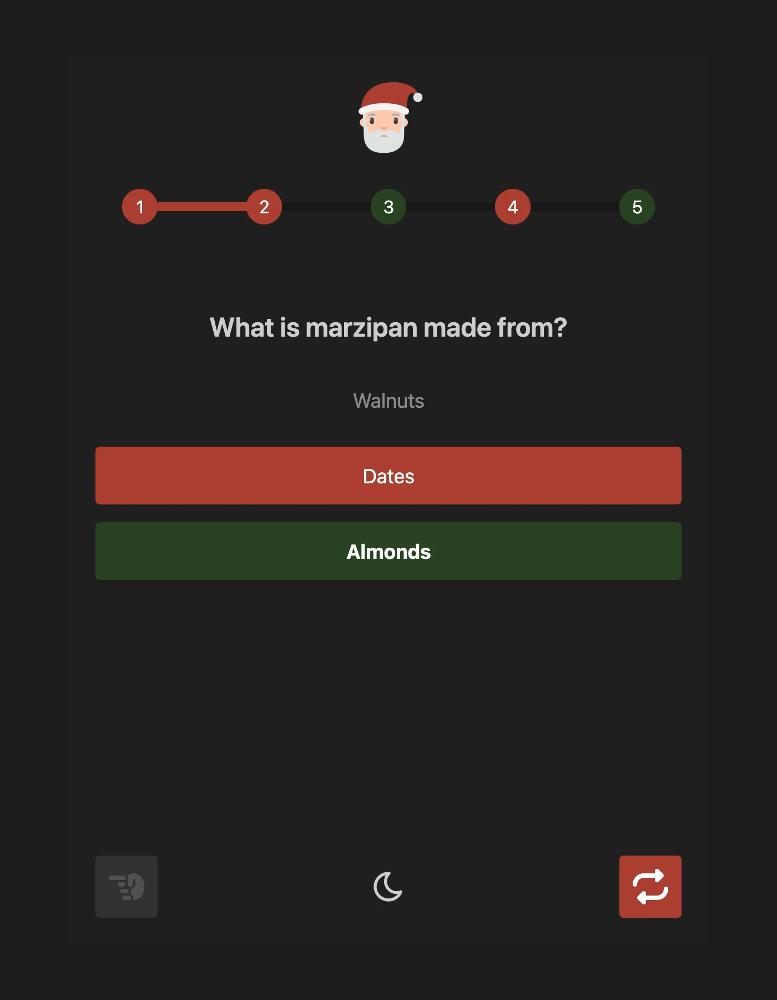
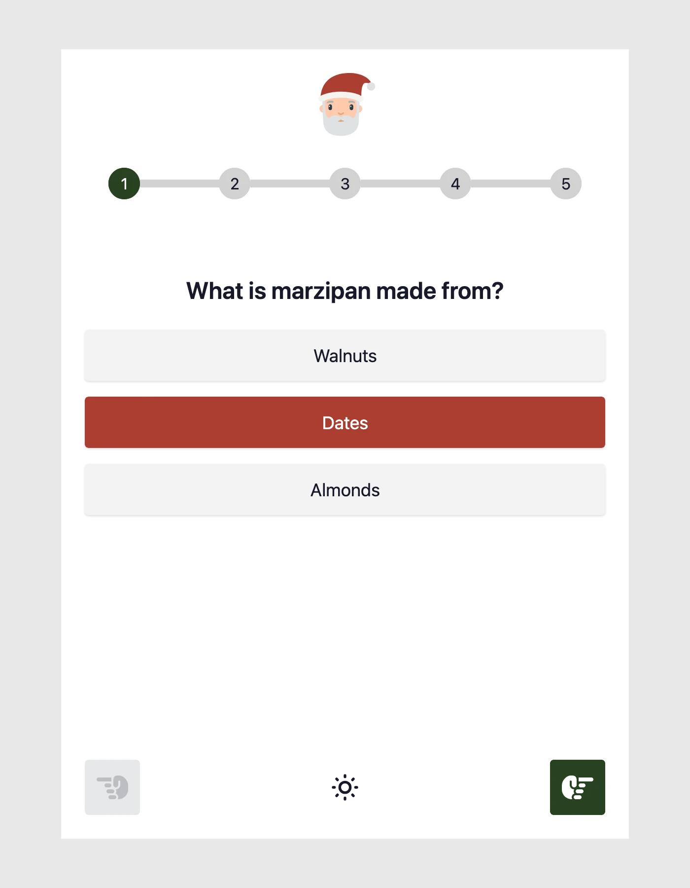
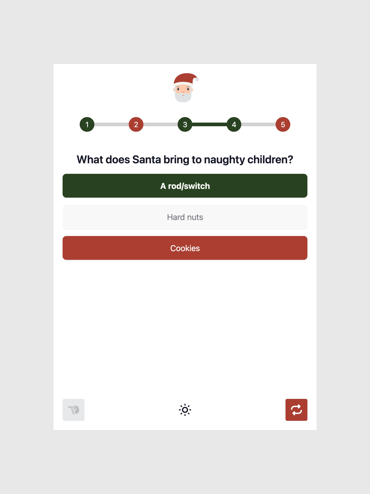

## Quiz Project

<p align="center">
  <br/>
  
  <br/>
  <br/>
  This project is a modern, full-stack quiz platform built with Go (backend) and Vue 3 (frontend), designed for easy deployment via Docker. It supports dynamic Theming, multi-language questions, and custom branding.
  <br/>
  <br/>
  </p>

## Table of Contents

- [Configuration](#configuration)
  - [Example: config/config.yaml](#example-configconfigyaml)
  - [Custom Logo](#custom-logo)
- [Screenshots](#screenshots)
  - [Dark mode](#dark-mode)
  - [Light mode](#light-mode)
- [Docker](#docker)
  - [run command](#run-command)
  - [compose file](#compose-file)
- [Update Dependencies](#update-dependencies)

## Configuration

All runtime configuration is managed via a YAML file in the `config/` directory. The main configuration file is `config.yaml`, which controls:

- Application title and amount of questions
- Supported languages
- Theming via CSS variables (primary, secondary, success, error colors)
- Icon SVGs for navigation and actions
- The quiz questions and answers (multi-language)

### Example: config/config.yaml

```yaml
app:
  title: Quiz
  amount_of_questions: 10
  languages:
    - en
    - de
  css_variables:
    --color-primary: '#294221'
    --color-primary-content: '#ffffff'
    --color-secondary: '#ac3e31'
    --color-secondary-content: '#ffffff'
    --color-success: '#294221'
    --color-success-content: '#ffffff'
    --color-error: '#ac3e31'
    --color-error-content: '#ffffff'
  icons:
    next: <svg .../>
    previous: <svg .../>
    submit: <svg .../>
    restart: <svg .../>
  logo: /app/config/logo.svg
questions:
  - id: 1
    question:
      en: What is the capital of France?
      de: Was ist die Hauptstadt von Frankreich?
    answers:
      en: [Berlin, Madrid, Paris]
      de: [Berlin, Madrid, Paris]
    correct_answer: 3
```

### Custom Logo

You can provide a custom logo by placing an SVG file at `config/logo.svg`. If the file does not exist, a default logo will be used. The logo is displayed in the quiz header.

## Screenshots

### Dark mode

<p align="center">
  
  
</p>

### Light mode

<p align="center">
  
  
</p>

## Docker

### run command

```sh
docker run -it --rm \
  --name quiz \
  -p 8156:8156 \
  -v ./config/:/app/config/ \
  ghcr.io/flohoss/quiz:latest
```

### compose file

```yml
services:
  quiz:
    image: ghcr.io/flohoss/quiz:latest
    restart: always
    container_name: quiz
    volumes:
      - ./config/:/app/config/
    ports:
      - '8156:8156'
```

## Update Dependencies

```bash
# Node packages
docker compose run --rm --pull always yarn upgrade --latest

# Go packages
docker compose run --rm --pull always go get -u && go mod tidy
```
